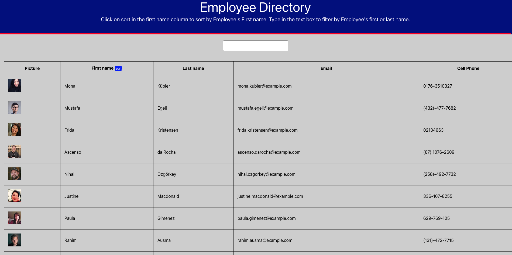
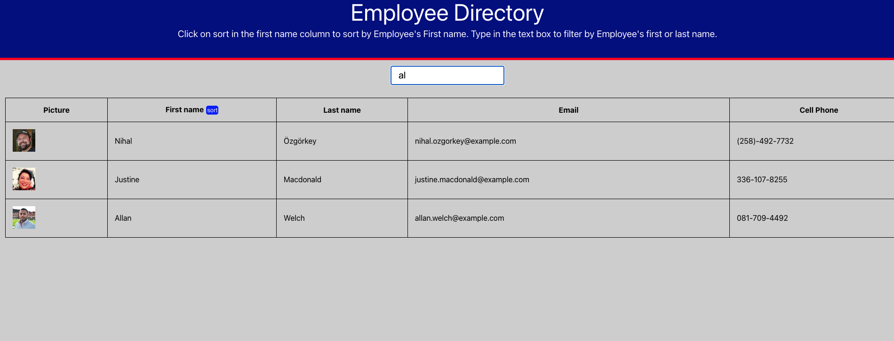

# Employee Directory

  

  ## Table of contents
  - [Description](#description)
  - [Installation](#installation)
  - [Usage](#usage)
  - [License](#license)
  - [Contributors](#contributors)
  - [Tests](#tests)
  - [Deployed Site](#deployed-site)
  - [Questions](#questions)

  ## Description
  App for allowing employee or manager to view non-sensitive data about other employees.

  ## Installation
  no install required. you can checkout github pages to see the deployed app 

  
  
   
  

  ## Usage
  * follow link to deployed application
  * click on the blue sort button in the first name column to sort alphabetically .
  * type in the text box to filter individual employees out by their first or last names.

  ## License
  

  The license covering this application is the MIT license.

  ## Contributors
  I am the sole contributor

  ## Tests
  There are no tests included

  ## Deployed Site
  You can visit the site using <a href="https://fast-mesa-53375.herokuapp.com/">GitHub Pages</a>

  ## Questions
  Find me on Github or reach out via email

  You can find me on GitHub at [trae77](https://github.com/trae77)

  Email me if you run into any questions at soccerreferee7@gmail.com
 
